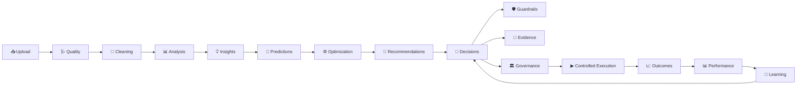
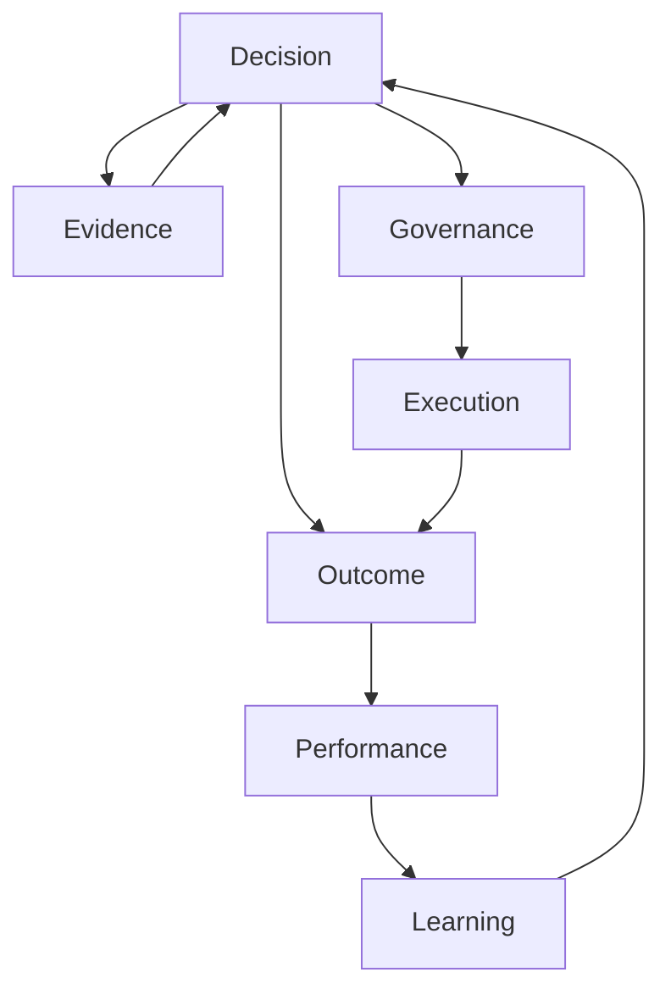
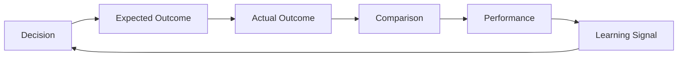
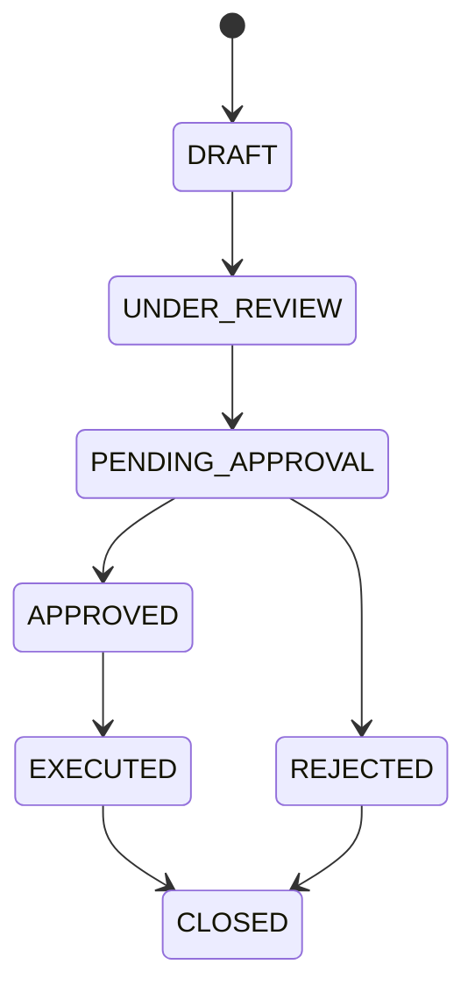
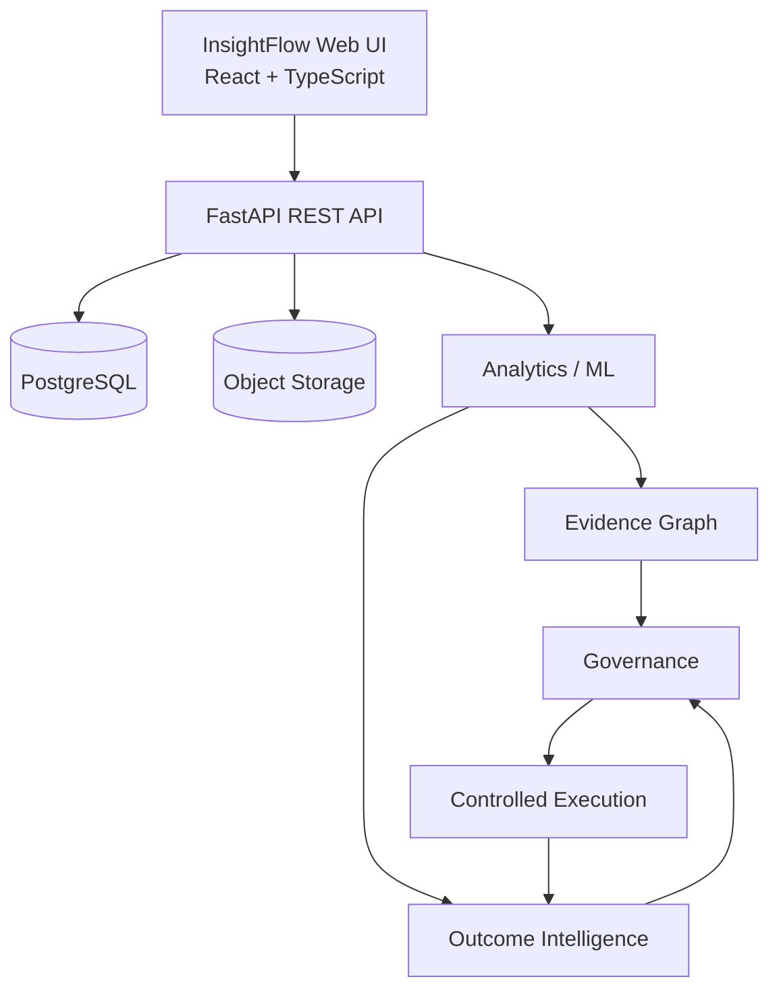

<div align="center">

# ✦ InsightFlow AI

### AI-Powered Decision Intelligence Platform

**From raw data → evidence → decisions → outcomes → learning**

<p>
  <a href="#-overview">Overview</a> ·
  <a href="#-platform-flow">Platform</a> ·
  <a href="#-decision-intelligence">Decision Intelligence</a> ·
  <a href="#-architecture">Architecture</a> ·
  <a href="#-quick-start">Quick Start</a>
</p>

[]()
[]()
[]()
[]()
[]()

</div>

---

## 🧠 Overview

**InsightFlow AI** is an end-to-end **Decision Intelligence Platform** designed to transform raw datasets into traceable, governed, outcome-aware decisions.

Unlike conventional analytics systems that stop at charts, dashboards, or predictions, InsightFlow continues through:

```text
DATA
 ↓
ANALYSIS
 ↓
INSIGHT
 ↓
PREDICTION
 ↓
OPTIMIZATION
 ↓
RECOMMENDATION
 ↓
DECISION
 ↓
EVIDENCE
 ↓
GUARDRAILS
 ↓
GOVERNANCE
 ↓
EXECUTION
 ↓
OUTCOME
 ↓
LEARNING
```

### The core question

> **What happened → Why did it happen → What should we do → Why this decision → What happened afterward → What did we learn?**

---

# 🚀 Platform Flow



---

# 📦 Core Platform

<details open>
<summary><strong>01 · Dataset Intelligence</strong></summary>

InsightFlow provides a persistent dataset workspace with:

- Workspaces
- Projects
- Dataset Registry
- Raw dataset preservation
- Processed artifacts
- Dataset lineage
- Dataset versioning
- Dataset comparison
- **What Changed?** analysis

### Data integrity principle

```text
RAW DATA
   │
   ├── remains immutable
   │
   ▼
PROCESSED ARTIFACT
   │
   ▼
DOWNSTREAM ANALYSIS
```

Cleaning never silently overwrites the raw source.

</details>

<details>
<summary><strong>02 · Analytical Intelligence</strong></summary>

The analytical workspace includes:

- Exploratory Data Analysis
- Dataset profiling
- Distribution analysis
- Correlation analysis
- Category analysis
- Trend analysis
- Statistical signals
- Automated insight extraction
- Machine-learning analysis

</details>

<details>
<summary><strong>03 · Predictive Intelligence</strong></summary>

Prediction workflows provide:

- ML task configuration
- Target selection
- Feature selection
- Candidate model evaluation
- Model metrics
- Prediction workspace
- Downstream optimization context

</details>

<details>
<summary><strong>04 · Optimization Intelligence</strong></summary>

Scenario-based optimization evaluates possible parameter changes against:

- measurable objectives
- observed bounds
- controllable variables
- model predictions
- feasibility constraints

The system separates:

```text
BASELINE
   ↓
SCENARIO
   ↓
PREDICTED IMPACT
   ↓
FEASIBILITY
```

</details>

<details>
<summary><strong>05 · Recommendation Intelligence</strong></summary>

Recommendations are derived from available analytical and predictive evidence.

Each recommendation can retain:

- rationale
- expected impact
- scenario context
- model context
- optimization context
- evidence provenance

</details>

---

# 🧭 Decision Intelligence

The decision layer is the core differentiator of InsightFlow.



## Nine Decision Intelligence Views

| Phase | Workspace | Purpose |
|---|---|---|
| 01 | **Decision** | Formalize the selected decision |
| 02 | **Evidence** | Trace supporting analytical evidence |
| 03 | **Outcome** | Compare expected vs actual results |
| 04 | **Performance** | Measure decision performance |
| 05 | **Learning** | Surface learning signals |
| 06 | **Governance** | Control review and approval |
| 07 | **Execution** | Manage controlled execution |
| 08 | **Audit** | Trace chronological events |
| 09 | **Knowledge** | Explore connected decision intelligence |

Each phase has its own visual identity while sharing the InsightFlow design system.

---

# 🔗 Evidence Graph

InsightFlow maintains an explicit evidence chain:

```text
Dataset
   ↓
Version
   ↓
Analysis Run
   ↓
Insight
   ↓
Prediction
   ↓
Optimization
   ↓
Recommendation
   ↓
Decision
   ↓
Guardrail
```

### Evidence question

> **Why does this decision exist?**

The Evidence Graph provides a persistent trace back to the supporting dataset, version, analysis, insight, model, optimization, and recommendation artifacts.

The platform does **not fabricate relationships** simply because two objects appear visually related.

---

# 🧬 Reproducibility

Every analysis run can preserve its execution context:

```text
DATASET
  ↓
VERSION
  ↓
PROCESSED ARTIFACT
  ↓
RUN TYPE
  ↓
CONFIGURATION
  ↓
OUTPUT
```

Tracked context may include:

- Project
- Dataset
- Dataset version
- Processed dataset
- Run type
- Configuration
- Input artifacts
- Output artifacts
- Status
- Error information
- Start/end timestamps
- Duration

This creates an auditable analytical execution history.

---

# 🧠 Insight Memory

InsightFlow remembers analytical patterns across dataset versions.

### Memory states

```text
NEW
 │
 ├── PERSISTED
 │
 ├── STRENGTHENED
 │
 ├── WEAKENED
 │
 └── DISAPPEARED
```

| State | Meaning |
|---|---|
| 🆕 NEW | Newly observed analytical pattern |
| ↔ PERSISTED | Pattern continues to be observed |
| ↗ STRENGTHENED | Pattern became stronger |
| ↘ WEAKENED | Pattern became weaker |
| ✕ DISAPPEARED | Pattern is no longer observed |

The system uses deterministic fingerprints to recognize recurring analytical patterns across versions.

---

# 📈 Decision Outcome Loop

InsightFlow goes beyond making a decision.



### Important principle

**Actual outcomes must come from real persisted observations.**

The platform does not fabricate actual results to make a decision look successful.

---

# 📊 Decision Performance

Performance intelligence can evaluate:

- Outcome coverage
- Match rate
- Material difference rate
- Absolute delta
- Relative delta
- Median relative delta
- Performance by metric
- Performance by model
- Performance by scenario
- Repeated deviations
- Time-based trends

The system distinguishes:

```text
INSUFFICIENT OBSERVATIONS
        ≠
MEANINGFUL DEVIATION
```

This avoids overinterpreting limited evidence.

---

# 🏛️ Governance

A key InsightFlow principle:

> **APPROVED ≠ EXECUTED**

Decision governance separates review from execution.



Governance remains human-controlled.

The platform does not autonomously:

- approve decisions
- reject decisions
- escalate decisions
- modify decisions

---

# ▶ Controlled Execution

Execution is intentionally separated from approval.

```text
NOT READY
    ↓
READY
    ↓
PENDING CONFIRMATION
    ↓
CONFIRMED
    ↓
EXECUTING
    ↓
EXECUTED
    ↓
OUTCOME MONITORING
    ↓
CLOSED
```

This provides an explicit execution record rather than implying that an analytical recommendation automatically changed the real world.

---

# 🎨 Product Experience

InsightFlow is designed as a **premium decision intelligence workspace**, not a generic AI dashboard.

### Typography

```text
Plus Jakarta Sans
        ↓
Primary UI typography

IBM Plex Mono
        ↓
Technical identifiers
timestamps
dataset IDs
machine metadata
```

### Visual language

- Deep navy canvas
- Cyan / blue intelligence accents
- Restrained violet
- Premium dark surfaces
- Technical grid
- Smooth transitions
- Subtle 3D depth
- Animated analytical signals
- State-aware loading experiences
- Strong typography hierarchy

### Design philosophy

> **Complexity should communicate intelligence, not create noise.**

---

# ⚡ Real Continuous Loading

InsightFlow uses state-driven loading experiences for asynchronous operations.

```text
REAL REQUEST STARTS
        ↓
CONTINUOUS MOTION
        ↓
REQUEST STILL RUNNING
        ↓
REAL RESPONSE
        ↓
SUCCESS / ERROR
        ↓
NEXT UI
```

Loading visuals can include:

- intelligence cores
- rotating rings
- moving signal paths
- orbiting particles
- analytical networks
- atmospheric background movement

### No fake progress

The animation does **not** determine when an API call finishes.

A 3-second request and a 60-second request use the same continuous animation architecture.

---

# 🏗️ Architecture



---

# 🛠️ Technology Stack

### Frontend

| Technology | Role |
|---|---|
| React | UI framework |
| TypeScript | Type-safe frontend |
| Vite | Build and development |
| Tailwind CSS | Styling |
| Framer Motion | Animation and transitions |
| Lucide React | Icons |

### Backend

| Technology | Role |
|---|---|
| Python | Backend language |
| FastAPI | REST API |
| SQLAlchemy | Database ORM |
| Pydantic | Validation / schemas |
| Alembic | Database migrations |

### Data / ML

| Technology | Role |
|---|---|
| PostgreSQL | Persistent application data |
| Pandas | Data processing |
| NumPy | Numerical analysis |
| Scikit-learn | Machine learning |
| Object Storage | Dataset artifacts |

---

# 📁 Project Structure

```text
InsightFlow AI/
│
├── frontend/
│   └── src/
│       ├── components/
│       ├── services/
│       ├── types/
│       └── ...
│
├── backend/
│   └── app/
│       ├── api/
│       ├── models/
│       ├── schemas/
│       ├── services/
│       └── ...
│
├── tests/
│
└── README.md
```

---

# 🔐 Security

Current application security includes:

- User authentication
- Password hashing
- JWT-based authentication
- Workspace ownership
- Workspace/project authorization
- Protected dataset access

Production environments should use secure secrets and deployment-specific security configuration.

---

# 🧱 Data Integrity Principles

| Principle | Implementation |
|---|---|
| **Raw Data** | Immutable |
| **Cleaning** | Separate processed artifact |
| **Lineage** | Dataset/version aware |
| **Evidence** | Explicit persisted relationships |
| **Outcomes** | Real persisted observations |
| **Governance** | Human-controlled |
| **Execution** | Explicit lifecycle |
| **Learning** | Review signal, not silent mutation |

---

# ▶️ Quick Start

## Prerequisites

Install:

- Node.js
- npm
- Python
- PostgreSQL
- Configured object storage / Supabase environment

### Frontend

```bash
cd frontend
npm install
npm run dev
```

### Backend

```bash
cd backend

python -m venv .venv
```

Windows:

```bash
.venv\Scripts\activate
```

Linux / macOS:

```bash
source .venv/bin/activate
```

Install dependencies:

```bash
pip install -r requirements.txt
```

Start the FastAPI application using the project's configured ASGI entrypoint.

### Database

```bash
alembic upgrade head
```

---

# 🧪 Testing

Backend:

```bash
pytest
```

Frontend build:

```bash
npm run build
```

For focused development, run the relevant test module rather than the entire suite.

---

# 🔌 API Domains

Core API domains include:

```text
/api/v1/workspaces
/api/v1/projects
/api/v1/datasets
/api/v1/runs
/api/v1/evidence
/api/v1/decisions
```

Additional functionality covers:

```text
Version Comparison
Insight Memory
Decision Performance
Learning Signals
Governance
Execution
Decision Reporting
Authentication
Authorization
```

---

# 🔄 End-to-End Example

```text
CSV Upload
    ↓
Dataset Quality Audit
    ↓
Non-Destructive Cleaning
    ↓
Exploratory Analysis
    ↓
AI Insight Extraction
    ↓
ML Prediction
    ↓
Scenario Optimization
    ↓
Action Recommendations
    ↓
Decision Formalization
    ↓
Evidence Traceability
    ↓
Guardrail Validation
    ↓
Governance Review
    ↓
Controlled Execution
    ↓
Actual Outcome
    ↓
Performance Evaluation
    ↓
Learning Signal
```

---

# 🗺️ Roadmap

<details>
<summary><strong>Potential Future Directions</strong></summary>

- Enterprise roles and permissions
- Scheduled data refresh
- Job orchestration
- Explicit lineage IDs for renamed datasets
- Advanced data drift intelligence
- Advanced model monitoring
- External execution integrations
- Richer decision knowledge exploration
- Report export workflows
- Deeper observability
- Expanded multi-project analytics

</details>

---

# 🌟 What Makes InsightFlow Different?

| Traditional Analytics | InsightFlow AI |
|---|---|
| Dashboard | Decision Workspace |
| Static report | Continuous analytical lifecycle |
| Prediction | Prediction + Optimization |
| Recommendation | Recommendation + Evidence |
| Decision | Governed Decision |
| Historical result | Outcome comparison |
| Performance metric | Decision Performance |
| Alerts | Learning Signals |
| Logs | Evidence + Audit Trail |
| Approval | Approval + Controlled Execution |

---

# 🧭 Product Philosophy

InsightFlow is built around five principles:

```text
1. Preserve the data
2. Make analysis reproducible
3. Make decisions traceable
4. Keep humans in control
5. Learn from outcomes
```

The ultimate goal is to move organizations from:

> **Analytics dashboards**

toward:

> **Accountable Decision Intelligence**

---

# 👨‍💻 Author

### Nikunj Rathi

**B.Tech Computer Science & Engineering**  
JECRC University, Jaipur

Focused on:

`AI` · `Data Analytics` · `Machine Learning` · `Decision Intelligence` · `Software Engineering`

---

<div align="center">

### ✦ InsightFlow AI

**From raw data to accountable decisions.**

</div>
